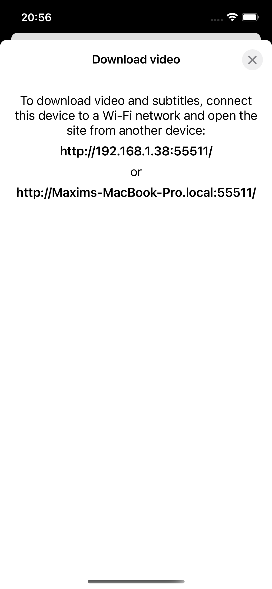
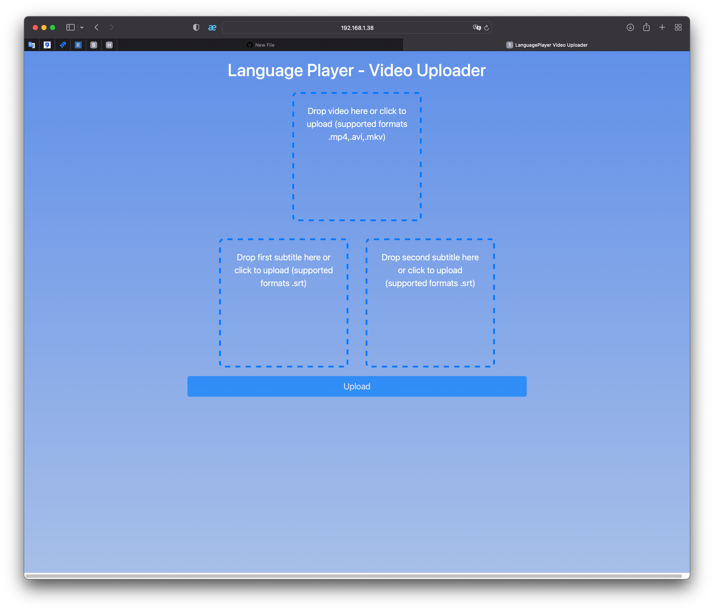
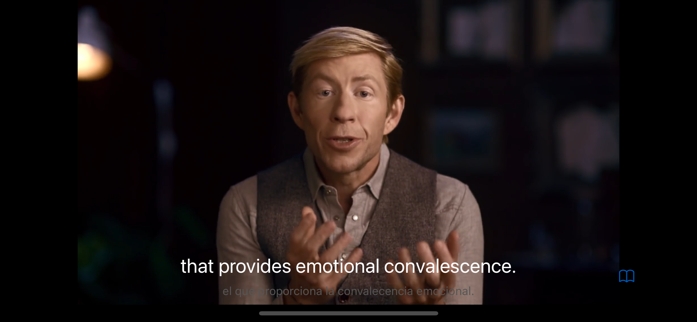

# LanguagePlayer
To watch videos with double subtitles

Abilities:
1) You can download video with external or/and embedded (mp4, mkv video formats) subtitles 
<table>
  <tr>
    <td> </td>
    <td></td>
   </tr> 
</table>
Technologies used for this: 
[GCDWebServer](https://github.com/swisspol/GCDWebServer) 
HTML/CSS/JS 

Embedded subtitles and audio tracks are extracted using [ffmpegkit](https://github.com/tanersener/ffmpeg-kit)

2) You can watch videos with double subtitles (choose subtitles in video settings)
<table>
  <tr>
    <td> </td>
   </tr> 
</table>
Technologies used for this: 
[MobileVLCKit](https://code.videolan.org/videolan/VLCKit) 
**Important** The VLC player lags in the iOS simulator. Use device. 

3) You can save current subtitle's pair as a card. All saved cards can be found in the Cards tab.
4) You can start the video from the card from the current subtitle timing.

For fun =) and first experience, the app was written in a reactive style ([RxSwift](https://github.com/ReactiveX/RxSwift)) with MVVM architecture.
